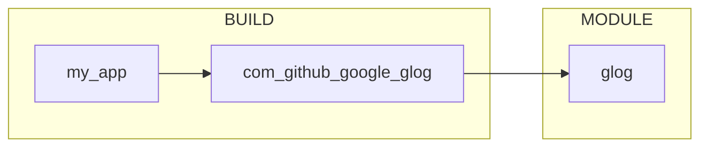

# Hello glog

## Dependencies



## Usage

```sh
export proxy_port=56458
export http_proxy=127.0.0.1:$proxy_port
export https_proxy=127.0.0.1:$proxy_port
```

```sh
sh build.sh
```

```sh
sh run.sh
```
